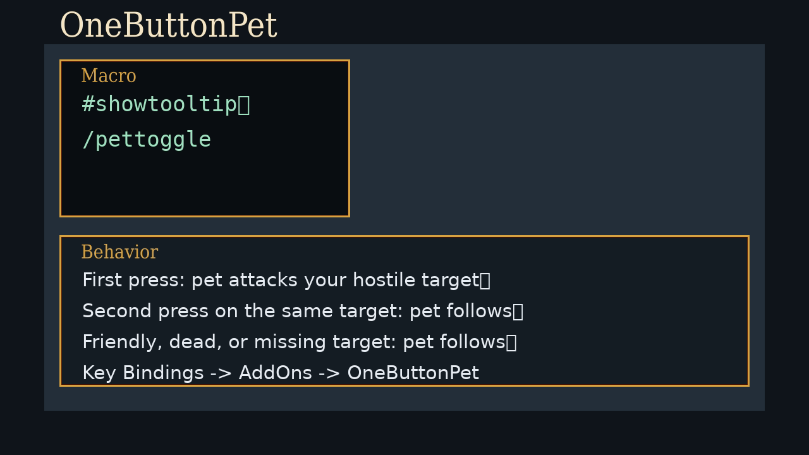

<p align="center">
  
</p>

<h1 align="center">OneButtonPet</h1>

<p align="center">
  TBC Anniversary Classic pet-control addon for a single attack/follow toggle button.
</p>

<p align="center"><strong>Current version:</strong> <code>1.0.1</code></p>

## Scope

- Target client: TBC Anniversary Classic
- TOC interface: `20504`

## Features

- One-button pet attack/follow toggle
- Slash command built for macro use: `/pettoggle`
- Direct key binding entry under `Key Bindings -> AddOns`
- Target-aware behavior:
  - First press on a hostile living target sends pet attack
  - Second press on that same target toggles pet follow
  - Friendly, dead, or missing target defaults to pet follow
- Lightweight state tracking with a short grace window so rapid double-taps still toggle reliably
- Local Lua regression tests and GitHub Actions validation

## Installation

1. Download or clone this repository.
2. Place the `OneButtonPet` folder in:
   - `World of Warcraft/_classic_/Interface/AddOns/`
3. Launch the game and enable `OneButtonPet` in the AddOns list.

## Usage

- Macro:

```text
#showtooltip
/pettoggle
```

- Slash commands:
  - `/pettoggle`
  - `/onebuttonpet`
  - `/obp`
  - `/pettoggle help`
  - `/pettoggle status`

- Direct binding:
  - Open `Key Bindings`
  - Go to the `AddOns` section
  - Bind `Toggle Pet Attack/Follow`

## In Game

<p align="center">
  
</p>

The addon replaces the usual split macro logic:

```text
#showtooltip
/petattack [harm,nodead]
/petfollow [dead]
/petfollow [help]
/petfollow [noexists]
```

with a single toggle command:

```text
#showtooltip
/pettoggle
```

## Development

Run local tests:

```bash
lua tests/run.lua
```

Syntax check:

```bash
luac -p OneButtonPet.lua
```

## Releasing

Release workflow details are in [`RELEASING.md`](RELEASING.md).

## Star History

[](https://www.star-history.com/#voc0der/OneButtonPet&Date)
